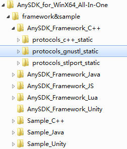
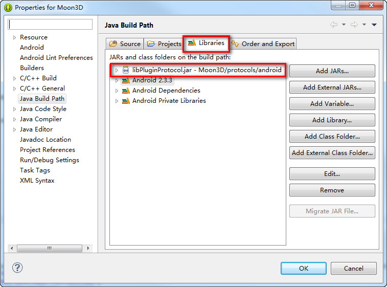
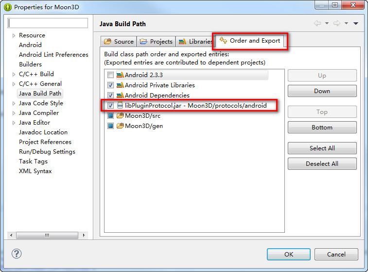
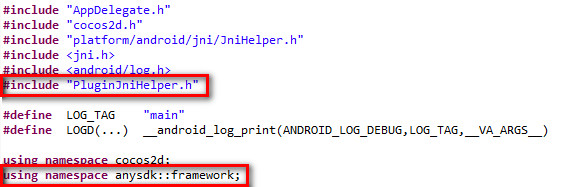
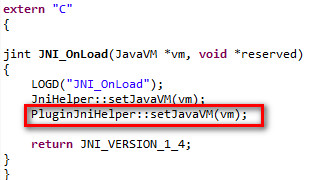
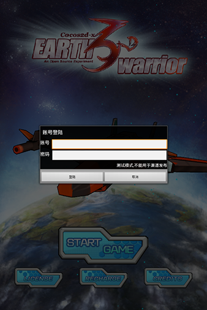
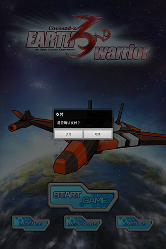
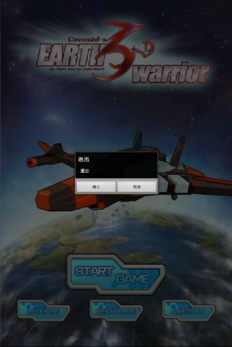

#AnySDK项目实战教程
##一、Cocos2d-x环境的搭建
关于Cocos2d-x的环境搭建,网上相关的教程已经有很多了，在此就简单的介绍一下。  
###1.1 所需工具及软件
1.[JDK](http://www.oracle.com/technetwork/java/javase/downloads/jdk7-downloads-1880260.html)（1.7版本）  
2.Android SDK（直接在Eclipse里下载所需要的SDK版本）  
3.[Android NDK](http://developer.android.com/sdk/index.html)（r9d及以上）  
4.[Ant](http://ant.apache.org/bindownload.cgi)  
5.[Python](https://www.python.org/downloads/release/python-278/)（2.7版本）  
6.[Eclipse ADT](http://developer.android.com/tools/sdk/ndk/index.html)  
7.VS2012（Windows）或XCode（Mac OS）  
8.[Cocos2d-x-3.3alpha0](https://github.com/cocos2d/cocos2d-x/tree/d1437540343dbf6c2ff4def708d60ed05bd3ec37)（本项目所使用的版本）  
 
###1.2 配置环境
准备好如上软件后，配置好JDK与Python的环境变量，执行Cocos2d-x下的setup.py进行各个环境变量的设置，然后就可以使用cocos命令了。

例子：  
创建工程：cocos new demo -p com.game.demo -l cpp -d d:\cocos  
编译Android：cocos compile -p android -j 4  
##二、AnySDK环境的搭建
下载[打包客户端及Framework](http://www.anysdk.com/downloads)，解压文件夹，安装AnySDK打包客户端。详细使用可查看[官方文档](http://docs.anysdk.com)。  

##三、实战项目的搭建
###3.1 项目源码下载
从github上下载[游戏项目](https://github.com/AnySDK/EarthWarrior3D)，由于cocos2d目录是引用Cocos2d-x-3.3alpha0的github，要确保有下载下来。（注意：Cocos2d-x 3.3alpha0中的plugin、bindings-generator、cocos2d-console也是引用）

由于external目录里的库并不完全，所以要运行cocos2d-x的download-deps.py下载external库。 

###3.2 项目搭建
####1.将AnySDK的Framework导入项目  
打开之前下载好的AnySDK文件夹，在AnySDK_Framework_C++里有三个文件夹，查看项目工程里的Android.mk里的STL库类型APP_STL := gnustl_static，所以这里要使用的就是protocols_gnustl_static文件夹。  
  

将protocols_gnustl_static文件夹复制到EarthWarrior3D的proj.android目录下，重命名为protocols。然后将其中的res文件夹里的东西放到proj.android的res目录里。

####2.修改Android.mk文件配置Framework编译选项   
1、头文件目录里添加protocols下的android和include目录。	

	LOCAL_C_INCLUDES := $(LOCAL_PATH)/../../Classes \
				$(LOCAL_PATH)/../protocols/android	\
				$(LOCAL_PATH)/../protocols/include

2、添加PluginProtocolStatic静态库	

	LOCAL_WHOLE_STATIC_LIBRARIES += PluginProtocolStatic

3、引入模块库	

	$(call import-module,protocols/android)   

###4.添加新路径至ndk module path   
本项目使用build_native编译，所以修改build_native.py文件：	

	if platform == 'win32':  
		ndk_module_path = 'NDK_MODULE_PATH=%s;%s;%s/external;%s/cocos' % ("./",cocos_root, cocos_root, cocos_root)  
	else:  
		ndk_module_path = 'NDK_MODULE_PATH=%s:%s:%s/external:%s/cocos' % ("./",cocos_root, cocos_root, cocos_root)  

如果使用cocos compile命令编译，则是修改build-cfg.json文件：

	"ndk_module_path" :[
			"../cocos2d",
			"../cocos2d/cocos",
			"../cocos2d/external",
			 ""
	    ],

###5.导入框架自带的的jar包并勾选export选项   
在Eclipse里导入游戏工程和libcocos2dx工程（cocos/platform/android/java），右键点击工程,选择Properties后选择Java Build Path,在面板上点击 Libraries,通过Add JARs...将libPluginProtocol.jar引进游戏工程。   
  
  

PS:如果使用cocos compile命令编译，要将libPluginProtocol.jar放到libs目录下，还需要在Application.mk里面添加一句NDK_TOOLCHAIN_VERSION=clang。

###6.配置AndroidManifest.xml添加框架需要的权限   

	<uses-permission android:name="android.permission.INTERNET" />   
	<uses-permission android:name="android.permission.ACCESS_NETWORK_STATE" />   
	<uses-permission android:name="android.permission.ACCESS_WIFI_STATE" />  
	<uses-permission android:name="android.permission.RESTART_PACKAGES" />  
	<uses-permission android:name="android.permission.KILL_BACKGROUND_PROCESSES" />  

##四、项目程序编写
###4.1 初始化AnySDK Framework
####1.初始化JavaVM   
首先，要在游戏工程加载jni的时候为AnySDK Framework设置JavaVM引用。先找到JNI_OnLoad函数，此函数是jni被加载时会首先被调用的函数。

本项目工程将platform/android目录下的javaactivity.cpp的JNI_OnLoad函数注释掉，然后拷贝JNI_OnLoad函数到main.cpp里。

1、导入头文件并声明命名空间。

	#include "PluginJniHelper.h"   
	using namespace anysdk::framework ;

  

2、并且添加上javaVM代码。  

	PluginJniHelper::setJavaVM(vm);

  

####2.在JAVA层初始化AnySDK Framework框架  
1、首先找到游戏工程的主Activity，本项目为AppActivity。   
2、然后重写Activity的onCreate()方法，并新增如下代码来初始化AnySDK Framework：  

	import com.anysdk.framework.PluginWrapper;

	protected void onCreate(Bundle savedState) {
		super.onCreate(savedState);
		PluginWrapper.init(this);
	}

重写Activity生命周期相关方法，代码如下：

	import android.content.Intent;

	@Override
	protected void onResume() {   
		PluginWrapper.onResume();      
		super.onResume();  
	}  
	@Override  
	public void onPause(){  
		PluginWrapper.onPause();  
		super.onPause();  
	}  
	@Override  
	protected void onActivityResult(int requestCode, int resultCode, Intent data){   
		PluginWrapper.onActivityResult(requestCode, resultCode, data);  
		super.onActivityResult(requestCode, resultCode, data);  
	}
	@Override
	protected void onNewIntent(Intent intent) {
		PluginWrapper.onNewIntent(intent);
		super.onNewIntent(intent);
	}

####3.创建好需要的JAVA类和C++类  
创建新的C++的文件来编写AnySDK的逻辑代码，本项目创建了个PluginChannel类来实现用户系统和支付系统的功能，PluginChannel类需要继承UserActionListener和PayResultListener，重写其事件回调函数。

JAVA创建一个wrapper类，用来调用C++的函数。在PluginChannel.cpp里定义wrapper的函数（nativeInitPlugins）。

wrapper.java的定义：

	public class wrapper {
		public static native void nativeInitPlugins();
	}

PluginChannel.cpp里nativeInitPlugins的定义：

	extern "C"
	{
		JNIEXPORT void JNICALL Java_org_cocos2dx_cpp_wrapper_nativeInitPlugins(JNIEnv*  env, jobject thiz)
		{
			PluginChannel::getInstance()->loadPlugins();
		}
	}

####4.在C++层初始化AnySDK Framework框架
在PluginChannel的loadPlugins函数里编写初始化、加载插件、设置监听等逻辑，然后调用该函数来进行初始化。在onCreate函数里的PluginWrapper.init(this)之后添加如下代码来进行初始化：

	wrapper.nativeInitPlugins();

在PluginChannel的loadPlugins函数里所要做的处理如下：  
1、初始化appKey、appSecret、privateKey、oauthLoginServer参数。

	std::string oauthLoginServer = "http://oauth.anysdk.com/api/OauthLoginDemo/Login.php";
	std::string appKey = "BC26F841-DAC5-9244-D025-759F49997A28";
	std::string appSecret = "1dff378a8f254ec8ad4b492cae72381b";
	std::string privateKey = "696064B29E9A0B7DDBD6FCB88F34A555";

	_agent = AgentManager::getInstance();
	_agent->init(appKey,appSecret,privateKey,oauthLoginServer);

2、加载所有插件。
	
	_agent->loadALLPlugin();

3、设置各个插件的Debug模式和监听等。

	_pluginUser = _agent->getUserPlugin();
	if(_pluginUser)
	{
		_pluginUser->setDebugMode(true);
		_pluginUser->setActionListener(this);
	}
	    
	_pluginsIAPMap  = _agent->getIAPPlugin();
	std::map<std::string , ProtocolIAP*>::iterator iter;
	for(iter = _pluginsIAPMap->begin(); iter != _pluginsIAPMap->end(); iter++)
	{
		(iter->second)->setDebugMode(true);
		(iter->second)->setResultListener(this);
	}

####5.编写PluginChannel类需要的函数
PluginChannel类里的函数众多，这里就介绍下其中的几个函数。

1、login函数，判断下是否有存在用户插件，存在则调用login函数弹出登陆界面。

	void PluginChannel::login()
	{
		if(_pluginUser)
		{
			_pluginUser->login();
		}
	}

2、payment函数，因为AnySDK支持多种支付方式，所以通过getIAPPlugin获取所有的支付插件。使用map容器来添加支付所需的各种参数信息，调用支付插件的payForProduct进行支付。如果使用多种支付方式，还需要自己处理相关UI及界面。

	void PluginChannel::payment()
	{
		if(_pluginsIAPMap)
		{
			std::map<std::string, std::string> productInfo;
			productInfo["Product_Price"] = "1";
			productInfo["Product_Id"] = "1";
			productInfo["Product_Name"] = "豌豆荚测试a1";
			productInfo["Server_Id"] = "13";
			productInfo["Product_Count"] = "1";
			productInfo["Role_Id"] = "1";
			productInfo["Role_Name"] = "1";
			productInfo["Role_Grade"] = "1";
			productInfo["Role_Balance"] = "1";
	    
			std::map<std::string , ProtocolIAP*>::iterator it = _pluginsIAPMap->begin();
			if(_pluginsIAPMap->size() == 1)
			{
	    
				(it->second)->setDebugMode(true);
				(it->second)->payForProduct(productInfo);
			}
			else if(_pluginsIAPMap->size() > 1)
			{
	    
				//多支付，游戏开发商自己处理相关UI及界面
			}
		}

	}

3、exit函数，通过isFunctionSupported判断下是否有存在exit函数，存在则调用函数来弹出退出界面。退出界面点击确定将回调kExitPage事件。

	void PluginChannel::exit()
	{
		if(_pluginUser && _pluginUser->isFunctionSupported("exit"))
		{
			_pluginUser->callFuncWithParam("exit",NULL);
		}
	}
	
4、退出游戏处理，在接收到退出游戏的回调事件后，释放PluginChannel的内存，调用cocos2d-x的Director类的end函数结束游戏。

	void PluginChannel::onActionResult(ProtocolUser* pPlugin, UserActionResultCode code, const char* msg)
	{
		switch(code)
		{
			case kExitPage://退出游戏回调
				purge();
				Director::getInstance()->end();
				break;
		}
	}

在析构函数里销毁用户系统以及卸载所有插件。

	PluginChannel::~PluginChannel()
	{
		destroy();
		unloadPlugins();
	}

	void PluginChannel::destroy()
	{
		if(_pluginUser && _pluginUser->isFunctionSupported("destroy"))
		{
			_pluginUser->callFuncWithParam("destroy",NULL);
		}
	}

	void PluginChannel::unloadPlugins()
	{
		_agent->unloadALLPlugin();
	}

####6.在游戏C++代码中调用PluginChannel类
为了保证Win32工程可以正常运行，所有涉及AnySDK的代码都采用条件宏判断，在Win32工程下不进行编译。

本项目只修改游戏工程的MainMenuScene类，也就是只在主菜单的场景里添加AnySDK的功能。

1、添加PluginChannel头文件

	#if (CC_TARGET_PLATFORM == CC_PLATFORM_ANDROID)
	#include "PluginChannel.h"
	#endif

2、修改startgame_callback函数，点击START GAME的时候将会调用login函数来弹出登陆框。

	void MainMenuScene::startgame_callback()
	{
		CCLOG("login");
	#if (CC_TARGET_PLATFORM == CC_PLATFORM_ANDROID)
		CCLOG("PluginChannel");
		bReady = true;
		PluginChannel::getInstance()->login();//调用渠道登陆
	#else
		CCLOG("startgame_callback");
		CocosDenshion::SimpleAudioEngine::getInstance()->stopBackgroundMusic();
		GameLayer::isDie=false;
		auto scene = (LoadingScene::audioloaded) ? HelloWorld::createScene() :LoadingScene::createScene();
		Director::getInstance()->replaceScene(scene);
		CCLOG("startgame_callback");
	#endif
	    
	}

3、修改update函数，通过isLogined函数判断登陆状态，当状态为登陆则跳转场景开始游戏。

	void MainMenuScene::update(float dt){
		pRate+=0.01;
		plane->setPosition3D(Vec3(visible_size_macro.width/2+50,480-20*sin(1.05*pRate),0));
	#if (CC_TARGET_PLATFORM == CC_PLATFORM_ANDROID)
		if(PluginChannel::getInstance()->isLogined()&&bReady)//判断登陆状态
		{
			CocosDenshion::SimpleAudioEngine::getInstance()->stopBackgroundMusic();
			GameLayer::isDie=false;
			auto scene = (LoadingScene::audioloaded) ? HelloWorld::createScene() :LoadingScene::createScene();
			Director::getInstance()->replaceScene(scene);
		}
	#endif

	}

4、修改recharge_callback函数，调用payment函数来显示支付界面。  

	void MainMenuScene::recharge_callback()
	{    
		CCLOG("recharge");  
	#if (CC_TARGET_PLATFORM == CC_PLATFORM_ANDROID)  
		CCLOG("PluginChannel");  
		PluginChannel::getInstance()->payment();//调用渠道支付  
	#else

	#endif
	}

5、重写onKeyReleased函数来监听按键事件，在Android按返回键的时候调用退出界面。  
在init函数里调用如下代码开启按键监听：

	setKeyboardEnabled(true);

重写onKeyReleased函数：

	void MainMenuScene::onKeyReleased(EventKeyboard::KeyCode keyCode, Event* event)
	{
	#if (CC_TARGET_PLATFORM == CC_PLATFORM_ANDROID)
		switch(keyCode)
		{
			case EventKeyboard::KeyCode::KEY_BACK:
				PluginChannel::getInstance()->exit();
				break;
		}
	#endif
	}

##五、编译运行游戏  
最后进行编译，在编译完工程后，就可以在手机或模拟器上安装apk运行游戏了，可使用测试账号（用户名：csdn，密码：csdn）进行登陆，游戏效果如下：  
   
  
  
